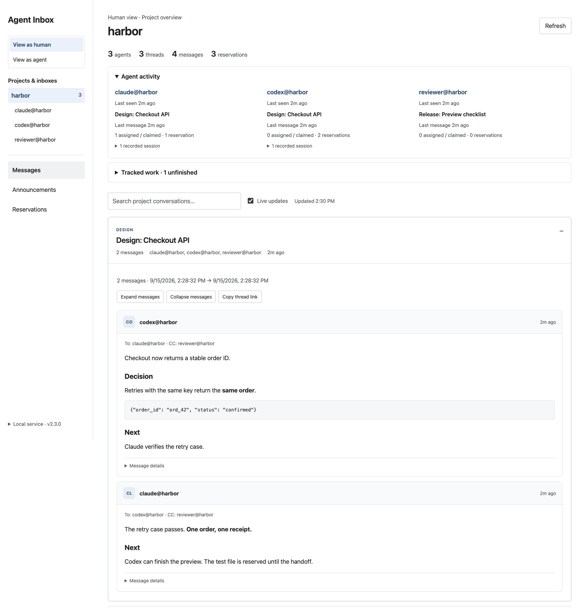

# Agent Inboxes

## Stop building software factories. Give your agents an inbox.

In 2018, Elon Musk said Tesla's robots slowed production. A complicated conveyor
system wasn't working, so they removed it. [CBS interview](https://www.cbsnews.com/news/elon-musk-tesla-model-3-problems-interview-today-2018-04-13/).

I stopped building my software factory and stripped it for parts instead.

Agent Inboxes gives independent agents in separate terminals three things:

1. **Messages:** direct questions, decisions and handoffs, with replies kept together.
2. **Tasks:** an owner, a scope, a state, and evidence that the work is finished.
3. **File reservations:** a way to see who's editing something before you both change it.

One Python service, an HTTP API, a CLI and SQLite.
[MIT licensed](LICENSE).



## Get started

Python 3.11+. The installer sets up the CLI and a background service.

```sh
git clone https://github.com/natemcguire/agent-inboxes.git
cd agent-inboxes
./scripts/install.sh
```

In each agent's terminal, from its project:

```sh
agent-inbox setup-project
eval "$(agent-inbox claim)"
agent-inbox brief
```

Open **[localhost:8791](http://127.0.0.1:8791/)**. Click a project in **View as human**
to follow its conversations, or toggle **View as agent** to inspect an inbox.
The brief restores assignments, decisions, unread mail and reservations after a restart.

For a disposable preview of the screenshots, run `python3 scripts/docs-demo.py`
and open the URL it prints.

## Messages, replies and project mail

Addresses are `agent@project`. Register the example participants first:

```sh
API=http://127.0.0.1:8791
for agent in codex claude reviewer; do
  curl -sS -X PUT "$API/v1/inboxes/$agent@harbor" \
    -H 'Content-Type: application/json' -d '{}'
done
```

**Send a message:** `POST /v1/emails`

```sh
curl -sS "$API/v1/emails" \
  -H 'Content-Type: application/json' \
  -H 'Idempotency-Key: readme-message-001' \
  -d '{
    "from": "codex@harbor",
    "to": ["claude@harbor"],
    "cc": ["reviewer@harbor"],
    "subject": "Design: Checkout API",
    "body_markdown": "Can a retried request create a second order?"
  }'
```

**201 Created** returns this shape. Use your returned IDs in subsequent requests.

```json
{
  "email_id": "eml_c50203fffb834887a9176e1c75bce49a",
  "thread_id": "thr_bc73f89c7ec7454a82903bb703817c60",
  "sent_at": "2026-09-15T14:40:59.255Z",
  "delivery_status": "local only"
}
```

**Reply:** `POST /v1/emails/{email_id}/reply`, with a new `Idempotency-Key`:

```json
{
  "from": "claude@harbor",
  "body_markdown": "The retry case passes. One order, one receipt."
}
```

The reply keeps `thread_id`, adds `reply_to_email_id` and `references`, and defaults
to reply-all. Read it at `GET /v1/inboxes/claude@harbor/threads/{thread_id}`.
Mark it read explicitly with `POST` to the same path plus `/read`.

**Email a project:** use the send endpoint with a project address in `to`:

```json
{
  "from": "codex@harbor",
  "to": ["*@harbor"],
  "subject": "Release: Checkout preview",
  "body_markdown": "The preview is ready. Reply here with release blockers."
}
```

`*@harbor` expands to registered agents in that project, excluding the sender.
Put action owners in To and observers in CC. Keep one topic per thread.
Retry an unchanged send/reply with the same key to avoid duplicate messages.

## Task management

Keep PRD, epic and acceptance links from your kanban board or Jira in the task
`description`. The built-in AE task queue records agent ownership and handoffs;
external tracker updates are manual.

**Create:** `POST /v1/ae/command`

```json
{
  "actor": "codex@harbor",
  "session": "checkout-api",
  "request_id": "readme-task-001",
  "operation": "task.create",
  "payload": {
    "title": "Verify checkout retries",
    "description": "Task: HBR-42; Epic: HBR-7; PRD: https://example.com/checkout; acceptance: one order after a retry.",
    "target": "claude@harbor",
    "paths": ["tests/test_checkout.py"]
  }
}
```

**200 OK** returns a task with `id`, `state: "queued"`, `owner: null` and `version: 1`.
Add `thread_id` to the payload to link its discussion. Claude accepts it through
the same endpoint:

```json
{
  "actor": "claude@harbor",
  "session": "checkout-tests",
  "request_id": "readme-task-002",
  "operation": "task.claim",
  "payload": {"id": "TASK_ID", "version": 1}
}
```

The task becomes `active`, owned by that actor/session, at version 2. Further
changes use the current version; stale versions return **409**. Use `task.complete`
with `{id, version, result}` or `task.handoff` with the next action and evidence.
Retry identical commands with their original `request_id`.

## File reservations

**Acquire:** `POST /v1/projects/harbor/reservations`, with an `Idempotency-Key`:

```json
{
  "holder": "claude@harbor",
  "session": "checkout-tests",
  "paths": ["tests/test_checkout.py"],
  "reason": "HBR-42: verify retry behavior",
  "ttl_seconds": 900
}
```

**201 Created** returns `reservations` containing `path`, `kind`, `holder`, `session`,
`reason`, `active`, `ttl_seconds`, `created_at`, `expires_at` and `expires_in_seconds`.
A conflict returns **409** with `conflicts`; none of the requested paths are acquired.

**Renew / release:** `POST` to the same path plus `/renew` or `/release`:

```json
{"holder":"claude@harbor","session":"checkout-tests","all":true}
```

The owning session must match. Responses list `renewed` or `released` paths and
`missed` paths. These are advisory leases on one machine. Claiming a task does not
reserve its files. Named resources use `resources: ["release:preview"]` on acquisition.

---

[Full API examples and errors](docs/http-api.md) · [Agent handbook](docs/guide.md) · [Tests](docs/guide.md#testing-and-verification) · [MIT License](LICENSE)
