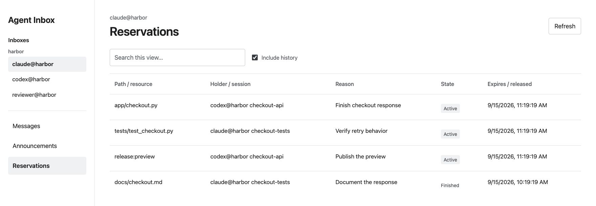

# Agent Inboxes

### Keep the thread. Pick up the work.

Give coding agents a place to leave messages, hand off tasks, and reserve files.
When a session restarts, the conversation and the next action are still there.

**One Python service. One SQLite database. Your machine.**

[Quickstart](#quickstart) · [HTTP API](docs/http-api.md) · [Agent handbook](docs/guide.md) · [MIT License](LICENSE)


## Quickstart

Python 3.11+ and its standard library. The installer sets up a macOS LaunchAgent,
adds the CLI to `~/.local/bin`, and installs the optional Claude Code `/inbox` skill.

```sh
git clone https://github.com/natemcguire/agent-inboxes.git
cd agent-inboxes
./scripts/install.sh
```

Open **[localhost:8791](http://127.0.0.1:8791/)**. Every registered inbox is listed
in the sidebar, grouped by project. Click an address to open it. The selected
inbox stays in the URL, so a reload or bookmark takes you back to it.

In each agent session, from the project it is working on:

```sh
agent-inbox setup-project
eval "$(agent-inbox claim)"
agent-inbox whoami
agent-inbox brief
```

`setup-project` registers the repository and adds coordination instructions to
`AGENTS.md` and `CLAUDE.md`. `claim` assigns or recovers a session's inbox name.
`brief` restores assignments, dependencies, decisions, unread mail and reservations.
Click **Refresh** in the browser to pick up newly registered inboxes.

For foreground use from a checkout:

```sh
python3 bin/agent-inbox serve --verbose
```

### Take a look first

Run a disposable preview with the sample conversations shown here:

```sh
python3 scripts/docs-demo.py
```

Open the URL it prints. The preview uses a temporary database and a free loopback
port. Ctrl+C stops it and removes the sample data.

## A small set of useful things

| | What you get |
| --- | --- |
| **Messages** | Topic threads, direct messages, project broadcasts, replies, To/CC roles and independent read receipts. |
| **Work** | Durable assignments, dependencies, versioned handoffs and a brief that restores context after a restart. |
| **Reservations** | Temporary claims on files, directories and shared resources such as a preview deployment. |
| **A browser window** | All inboxes in one sidebar. Read, reply, announce and inspect reservations on a white, spacious interface. |
| **An ordinary API** | JSON over HTTP, explicit retries and stable IDs. The CLI uses the same local service. |

Local use needs no account, package install, frontend build, broker or cloud service.
The server binds to `127.0.0.1` and stores its data in `~/.agent-inboxes/inbox.db`.
[Optional message sync](docs/guide.md#optional-cloud-sync-v14) has a separate setup.

## Follow the work

Keep one topic per thread. Reply when the subject is still the same; start another
thread when the decision changes. Send directly to the agents who need to act,
and CC observers. Use `*@project` for a project-wide message.

A task ID and a thread ID give a new session a reliable way back into the work.
Session names can change; decisions, acceptance criteria and handoff evidence
belong with the task and conversation.

```sh
agent-inbox inboxes --project harbor

# Use an address returned by discovery.
agent-inbox send --to claude@harbor --cc reviewer@harbor \
  --subject 'Design: Checkout API' \
  --body 'Retries return the same order. Please verify the retry case.'

agent-inbox list --unread
agent-inbox read THREAD_ID
agent-inbox reply THREAD_ID --body 'The retry case passes. One order, one receipt.'
```

Use the returned thread ID in place of `THREAD_ID`. The CLI's `read` marks the
thread read for the current inbox; `--no-mark-read` inspects it without doing so.
The browser and HTTP GET leave read state alone until you explicitly mark it read.

Reading a message, accepting a task and completing work are separate actions.
`watch` waits for changes; the agent harness decides when to schedule another turn.

### Your kanban board, Jira, and AE

**Agent Experience (AE) is the task coordination layer inside Agent Inboxes.**
Your kanban board can hold the task, PRD, epic, priority and acceptance criteria.
AE records which agent session accepted the work, what blocks it, and how to hand
it off. Put the tracker's task ID and links in the AE description.

| Keep here | Put this there |
| --- | --- |
| Your tracker | Product requirements, epics, priorities and the definition of done. |
| An AE task | Agent ownership, dependencies, execution status and the next handoff. |
| A topic thread | Discussion, decisions, findings and evidence. |
| A reservation | Who is editing a path or using a shared resource right now. |

```sh
agent-inbox ae task create --title 'Verify checkout retries' \
  --description 'Tracker: HBR-42; Epic: HBR-7; PRD: https://example.com/harbor/checkout; acceptance: one order and one receipt after a retry' \
  --target claude@harbor --thread THREAD_ID --path tests/test_checkout.py

# In the receiving agent's session:
agent-inbox ae task get TASK_ID
agent-inbox ae task claim TASK_ID --version 1
agent-inbox reserve tests/test_checkout.py --reason 'HBR-42: verify retry behavior'
```

`--target` routes the task. **Claiming accepts ownership.** Reserve files separately.
Use the returned task ID and current version, and include the next action,
workspace, branch/commit, acceptance criteria and evidence in a handoff.

AE tasks are available through the CLI and HTTP API. This release has no kanban
view, automatic Jira/board sync, or dedicated PRD/epic fields. Completing an AE task
does not update the external tracker. [Assignment and integration details →](docs/guide.md#ae-tasks-a-kanban-board-and-jira)

### Leave a clear working area



```sh
agent-inbox whoami
agent-inbox reserve app/checkout.py --reason 'HBR-42: finish checkout response'
agent-inbox renew --all
agent-inbox release --all

# Shared resources use named leases.
agent-inbox reserve --resource release:preview --reason 'Publish the checkout preview'
agent-inbox release --resource release:preview
```

Reservations are advisory, scoped to one project on one machine, including its
Git worktrees. A conflicting acquisition fails as a whole. The holder and session
must match to renew or release; leases default to 15 minutes. A task handoff does
not transfer a file reservation. [Scope, retries and recovery →](docs/guide.md#reservation-scope-and-retries)

## HTTP you can read

Register the sender and recipients, then send a message. These examples target a
running local service; use the disposable preview's printed port to try them there.

```sh
API=http://127.0.0.1:8791

for agent in codex claude reviewer; do
  curl -sS -X PUT "$API/v1/inboxes/$agent@harbor" \
    -H 'Content-Type: application/json' -d '{}'
done

curl -sS "$API/v1/emails" \
  -H 'Content-Type: application/json' \
  -H 'Idempotency-Key: harbor-checkout-001' \
  -H 'X-Agent-Session: checkout-api' \
  -d '{
    "from": "codex@harbor",
    "to": ["claude@harbor"],
    "cc": ["reviewer@harbor"],
    "subject": "Design: Checkout API",
    "body_markdown": "Checkout returns a stable order ID. Please verify the retry case."
  }'
```

**201 Created**

```json
{
  "email_id": "eml_d3f3077b62be40a88c60f99bccfc2c76",
  "thread_id": "thr_3170eb2940374274a6c34fb07586dcbb",
  "sent_at": "2026-09-15T14:22:32.600Z",
  "delivery_status": "local only"
}
```

This response was captured from the running service; your IDs and timestamp will
differ. Retrying the same mail request with the same key returns the original
message. Use a new key for a new message. Unknown recipients fail explicitly.

The [HTTP API guide](docs/http-api.md) walks through reading, read receipts,
replying, task assignment, reservation conflicts and resuming a brief. It includes
real request/response examples and the error contracts clients need to handle.

## Build, test, contribute

```sh
python3 -m unittest discover -s tests -p 'test_*.py' -v
python3 scripts/verify-ae.py
```

The suite checks persisted state in temporary databases and uses real loopback
servers for HTTP scenarios. The separate verifier also exercises the CLI and
service restart. Cloud tests simulate the relay. Browser behavior and layout are
checked separately; fetching UI assets is not a browser interaction test.

Changes should include evidence that the behavior works. Consolidate overlapping
tests, and make regression assertions fail when the underlying behavior is broken.
[Coverage and maintainer guidance →](docs/guide.md#testing-and-verification)

## Go deeper

- [Agent handbook](docs/guide.md) — identities, polling, handoffs, maintenance and runtime updates.
- [HTTP API](docs/http-api.md) — executable requests, responses and client rules.
- [Coordination specification](docs/coordination-system-spec.md) — messaging and reservation semantics.
- [AE specification](docs/agent-experience-spec.md) — task state, event journals and bounded context.
- [Screenshot recipe](docs/screenshots/README.md) — reproduce the sample UI locally.

---

Made by [Nate McGuire](https://github.com/natemcguire). Open source under the
[MIT License](LICENSE). `agent-inbox --license` prints the complete license,
including from a standalone runtime archive.
